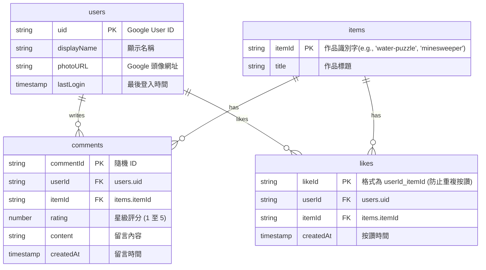

# 個人學習歷程評論：網站設計提案

本專案旨在為您打造一個具備「個人簡介」、「JavaScript 學習紀錄」與「期末專題預留連結」的**高質感響應式個人 Portfolio 網站**，並結合 **Google Firebase** 後端服務與 **Google 帳號登入**功能，讓訪客能針對您的各項作品進行「按讚」、「留言評論」與 **「1-5 星級評分」**。

---

## 技術棧與架構設計 (Proposed Architecture - Google Ecosystem)

為了解決「實際上線」、「包含資料庫與登入」的需求，我們全面採用 **Google 旗下的 Firebase 生態系**。這是一套極為成熟、穩定且速度極快的無伺服器 (Serverless) 架構，完全免收費且無冷啟動延遲：

1. **前端 (Frontend)**：**React (Vite)**
   - 使用 **Vanilla CSS** 撰寫精美的玻璃擬物化 (Glassmorphic) 深色主題，具備微動態特效與平滑過渡。
   - 整合 `lucide-react` 提供精美現代的圖示。
2. **後端與資料庫 (Google Firebase)**：
   - **身分驗證 (Firebase Authentication)**：直接整合 **Google Sign-In**，讓使用者以 Google 帳號安全登入，並取得使用者的暱稱與頭像。
   - **資料庫 (Cloud Firestore)**：Google 的雲端 NoSQL 資料庫，儲存評論、星級與按讚紀錄。支援實時同步監聽 (Real-time Listeners)，當有人留言評分或按讚時，網頁會即時動態更新，不需重整網頁。
   - **託管平台 (Firebase Hosting)**：將前端網頁部署至 Google 的全球 CDN 節點，網速極快、支援 SSL (HTTPS) 且完全免費。

---

## 頁面結構與視覺設計 (UX/UI Design)

我們將採用**暗黑科技風 (Dark Tech Aesthetic)** 搭配漸層霓虹光暈與玻璃感卡片，打造極致的視覺體驗：

1. **英雄導覽區 (Hero Section)**：
   - 個人大頭照、動態打字機特效（資工系、網頁開發者、技術助理...）。
   - 串接 **Google 登入按鈕**（登入後顯示使用者頭像、姓名與登出按鈕）。
2. **關於我 (About Me)**：
   - 以卡片化呈現南臺科技大學資訊工程系的背景。
   - 證照技能區（TQC+ C++、資訊安全工程師初級）。
   - 獲獎紀錄與教學助理經歷（折疊式手風琴或互動時間軸呈現，增加趣味性）。
3. **JavaScript 作品集 (JS Learning Records)**：
   - 包含三個精美卡片：
     1. **網站架設**：個人網站專案介紹。
     2. **Water Puzzle 小遊戲**：附遊戲畫面預覽，點擊可於燈箱/新分頁中直接遊玩。
     3. **Minesweeper 踩地雷小遊戲**：附遊戲畫面預覽，點擊直接遊玩。
   - 每個卡片下方都有獨立的：
     * **平均星等顯示**（如：⭐ 4.8 / 5.0，並顯示總評分人數）。
     * **按讚按鈕**（點擊動態發光與計數）。
     * **留言板入口**。
4. **期末專題預留區 (Final Project Link)**：
   - 設計一個高亮度的「未來感」卡片，預留外連網址（點擊跳轉至您的另一個專案網站），並同樣支援按讚、留言與五星級評分功能。
5. **即時互動五星評論區 (Interactive Rating & Review System)**：
   - 訪客未登入時顯示「請先登入 Google 帳號以發表留言與評分」。
   - 登入後，可選擇特定作品，並利用**互動式星星組件 (1 至 5 顆星)** 進行評分，並輸入留言內容。
   - 留言會即時渲染（包含 Google 頭像、姓名、評分星等、時間與評論內容）。

---

## Firebase Firestore 資料庫結構 (Database Schema)

我們將在 Firestore 中建立三個主要的集合 (Collections)，其中 `comments` 集合新增了 `rating` 星級欄位：

---

## 用戶審查要點 (User Review Required)

> [!IMPORTANT]
> 1. **Firebase 專案與 Google 登入設定**：要使用 Google 帳號登入，我們需要在 **Firebase Console** 建立一個新專案並啟用 Google Auth。我會為您提供非常詳細、有圖片說明的設定指南，這部分需要您在 Firebase 控制台點擊幾下。
> 2. **本機開發與環境變數**：我們會在專案中建立一個 `.env` 檔案來存放 Firebase 的金鑰配置（例如 `apiKey`, `authDomain` 等），這些金鑰是公開安全的。

---

## 開發計畫與步驟 (Implementation Steps)

1. **步驟一：初始化專案與目錄結構**
   - 在 `C:\Users\STUST\Music\PortfolioHub` 初始化 React (Vite) 專案。
   - 建立 Vanilla CSS 設計系統（變數、字型、卡片樣式、動畫效果）。
2. **步驟二：建立 Firebase 專案與啟用服務**
   - 協助您在 Firebase Console 建立專案。
   - 啟用 Cloud Firestore、Firebase Authentication (Google 登入) 與 Firebase Hosting。
3. **步驟三：前端整合 Firebase**
   - 安裝 `firebase` SDK。
   - 撰寫 Firebase 初始化設定，實作 Google 登入與登出邏輯。
4. **步驟四：開發前端 UI 與互動功能**
   - 刻畫漂亮的個人簡介與 JavaScript 作品集卡片。
   - 實作**互動式 1-5 星選取組件**。
   - 串接 Firestore 資料庫讀寫（留言、評分與按讚），啟用實時數據監聽並動態計算平均星等。
5. **步驟五：打包與部署上線**
   - 使用 `firebase-tools` CLI 工具將網頁一鍵部署至 Firebase Hosting，並確認線上版可正常運作。

---

## 驗證計畫 (Verification Plan)

- **功能測試**：
  - [ ] 驗證 Google 登入功能：登入後能正確顯示使用者頭像與姓名。
  - [ ] 驗證按讚功能：點擊後資料庫數值增加，再次點擊可取消讚。
  - [ ] 驗證五星評論功能：使用者留言時可選擇 1-5 顆星，留言後正確顯示該留言的星級，且作品的平均星等會即時重新計算並渲染。
  - [ ] 驗證路由與小遊戲跳轉：點擊遊戲能順利導航到對應的子頁面或外連。
- **效能與美觀測試**：
  - 在不同螢幕解析度下（手機、平板、電腦）進行 RWD 響應式佈局測試，確保視覺完美。
